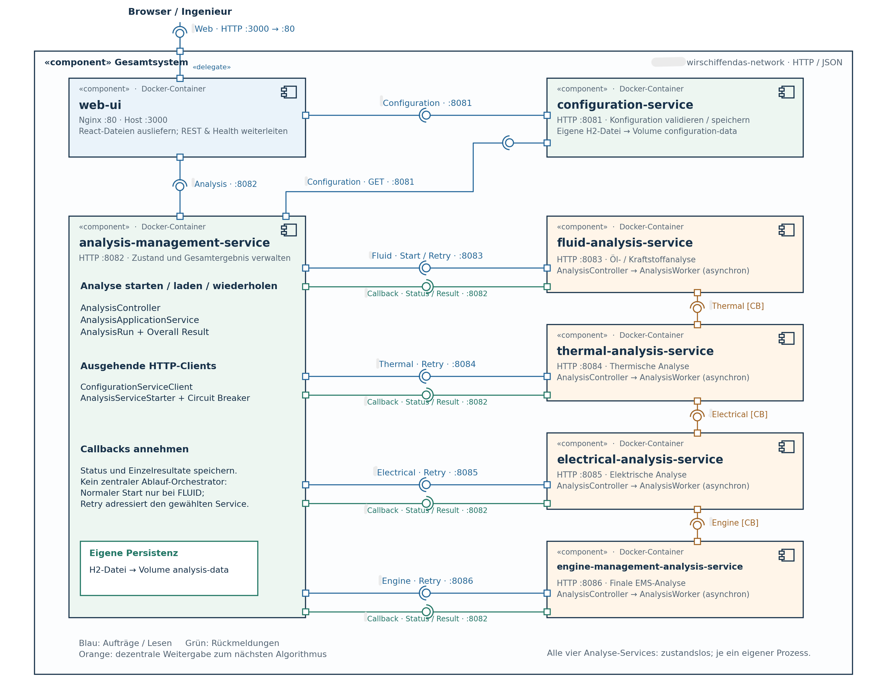

# WirSchiffenDas – 4-Sichten-Modell

Die Architektur wird ergänzend zu `ddd.md` und `architecture.md` in vier kompakten Sichten dokumentiert. Die Diagramme liegen unter `docs/diagrams/`. Die aktuellen Sichten liegen als PNG- bzw. JPEG-Abbildungen vor.

## 1. Kontextsicht

Datei: `docs/diagrams/Kontextsicht.jpeg`

Zweck: Zeigt die Systemgrenze und den wichtigsten Akteur. Der Ingenieur nutzt das System zum Anlegen von Konfigurationen, zum Starten einer Analyse, zum Beobachten des Status und zum Retry.

## 2. Bausteinsicht

Datei: `docs/diagrams/Bausteinsicht.png`.

Ergänzende Monitoring-Abbildung: `docs/diagrams/Bausteinsicht-monitoring.png`.

Zweck: Zeigt die sechs fachlichen Microservices und ihre wesentlichen Beziehungen. Die vier Analyse-Services bilden die choreographierte Analyse-Kette. Configuration und Analysis Management besitzen getrennte Datenhoheit.

## 3. Laufzeitsicht

Datei: `docs/diagrams/Laufzeitsicht.jpeg`

Zweck: Zeigt den dynamischen Ablauf einer Analyse. Die Abbildung zeigt den Happy Path. Fehlerfall und Retry sind ergänzend im Text der arc42-Dokumentation beschrieben.

## 4. Verteilungssicht

Datei: `docs/diagrams/Verteilungssicht.jpeg`

Zweck: Zeigt das Deployment auf einem Docker Host. Jeder Microservice läuft in einem eigenen Container. Configuration und Analysis Management besitzen getrennte persistente Volumes.

## Zusammenhang mit arc42

Die vier Sichten können später nahezu unverändert in die arc42-Dokumentation übernommen werden:

- Kontextsicht → Kontextabgrenzung
- Bausteinsicht → Bausteinsicht
- Laufzeitsicht → Laufzeitsicht
- Verteilungssicht → Verteilungssicht

Die Dokumentation bleibt bewusst knapp: Die Diagramme zeigen nur Architekturinformationen, die für den Proof-of-Concept und die zentralen Qualitätsziele relevant sind.
