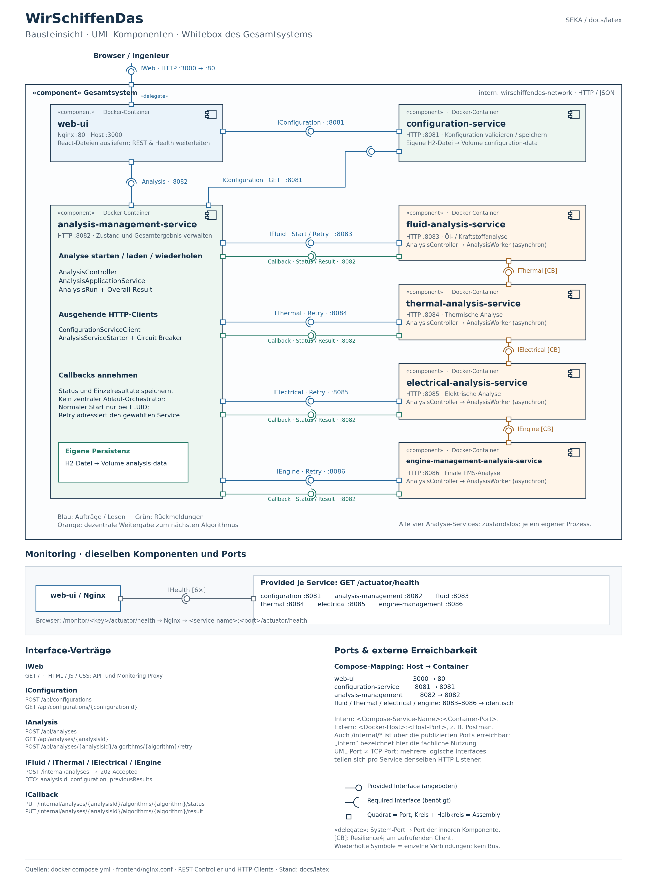

# WirSchiffenDas – 4-Sichten-Modell

Die Architektur wird ergänzend zu `ddd.md` und `architecture.md` in vier kompakten Sichten dokumentiert. Die Diagramme liegen unter `docs/diagrams/`. Die Bausteinsicht wird mit Python/Matplotlib als PNG und SVG erzeugt.

## 1. Kontextsicht

Datei: `docs/diagrams/context.puml`

Zweck: Zeigt die Systemgrenze und den wichtigsten Akteur. Der Ingenieur nutzt das System zum Anlegen von Konfigurationen, zum Starten einer Analyse, zum Beobachten des Status und zum Retry.

## 2. Bausteinsicht

Dateien: `docs/diagrams/building-blocks.svg` und `docs/diagrams/building-blocks.png`.

Generator: `python docs/diagrams/generate_building_blocks.py`. Notation, Ports und Reproduktion: [Diagramm-README](diagrams/README.md).

Zweck: Zeigt die sechs fachlichen Microservices und ihre wesentlichen Beziehungen. Die vier Analyse-Services bilden die choreographierte Analyse-Kette. Configuration und Analysis Management besitzen getrennte Datenhoheit.

## 3. Laufzeitsicht

Datei: `docs/diagrams/runtime.puml`

Zweck: Zeigt den dynamischen Ablauf einer Analyse. Enthalten sind der Happy Path sowie der relevante Fehlerfall, bei dem Thermal nicht erreichbar ist und später per Retry fortgesetzt wird.

## 4. Verteilungssicht

Datei: `docs/diagrams/deployment.puml`

Zweck: Zeigt das Deployment auf einem Docker Host. Jeder Microservice läuft in einem eigenen Container. Configuration und Analysis Management besitzen getrennte persistente Volumes.

## Zusammenhang mit arc42

Die vier Sichten können später nahezu unverändert in die arc42-Dokumentation übernommen werden:

- Kontextsicht → Kontextabgrenzung
- Bausteinsicht → Bausteinsicht
- Laufzeitsicht → Laufzeitsicht
- Verteilungssicht → Verteilungssicht

Die Dokumentation bleibt bewusst knapp: Die Diagramme zeigen nur Architekturinformationen, die für den Proof-of-Concept und die zentralen Qualitätsziele relevant sind.
